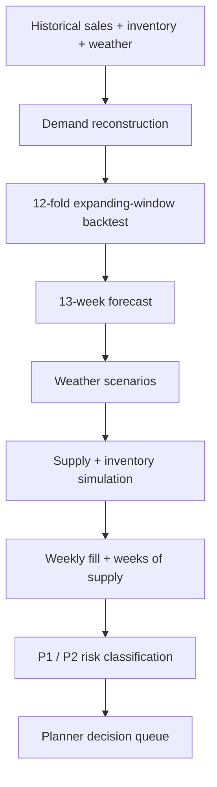
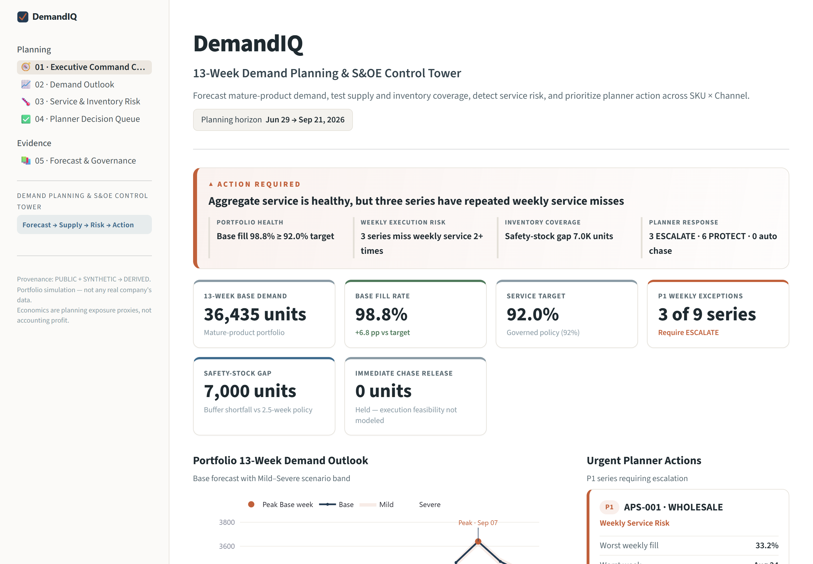
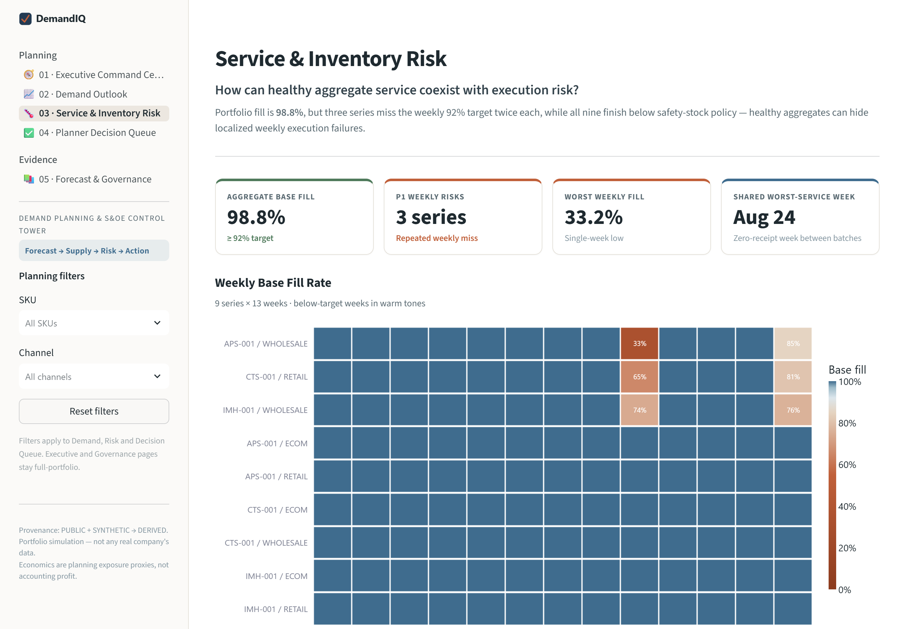
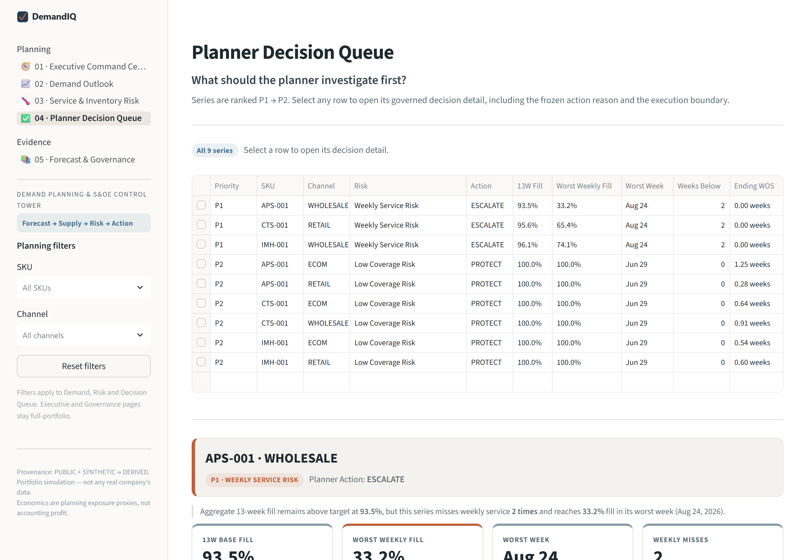

# DemandIQ

## Retail Demand Planning & S&OE Decision System

DemandIQ is a portfolio case study showing how I would approach a mature-product demand-planning problem from **stockout-hidden demand → governed forecast → supply timing → inventory coverage → weekly service risk → planner action**.

> **36.4K units Base demand · 98.8% portfolio fill · 3 acute weekly service risks · 9 of 9 series end below coverage policy · 0 units auto-chased**

**Scope:** Mature products · 13-week in-season horizon · Week × SKU × Channel · 9 forecast series

> **Simulation only.** DemandIQ uses synthetic planning data and does not use or represent any company's internal data. Economic values are planning exposure proxies, not accounting profit.

---

## Start here

- **Case study:** [DemandIQ_Case_Study.pdf](./DemandIQ_Case_Study.pdf)
- **Streamlit app:** add the public `streamlit.app` link here after deployment
- **Model evidence:** [`03_model_evidence/`](./03_model_evidence/)
- **Analytical pipeline:** [`04_scripts/`](./04_scripts/)
- **Decision outputs:** [`05_outputs/`](./05_outputs/)

---

## The planning problem

Two issues drive the case:

### 1. Observed sales are not always demand

When inventory constrains availability, sales become censored. Forecasting those sales directly can teach the model that stockout weeks were low-demand weeks and bias the future plan downward.

### 2. A forecast is not a decision

Even with a credible forecast, a planner still needs to know:

- When does supply arrive?
- Which SKU × Channel series will miss weekly service?
- How much forward coverage remains?
- Which risks deserve escalation?
- Which actions are actually operationally feasible?

DemandIQ connects those questions through one governed chain:

```text
Demand signal
→ Demand reconstruction
→ Forecast
→ Supply / receipts
→ Inventory / coverage
→ Weekly service
→ Risk prioritization
→ Planner action
```

---

## What I built

A nine-series planning workflow across **3 SKUs × 3 channels**, using ~260 weeks of history and a 13-week forward horizon.



| SKU | Product | Channels |
|---|---|---|
| APS-001 | Alpine Performance Shell | ECOM · RETAIL · WHOLESALE |
| CTS-001 | Core Technical Shell | ECOM · RETAIL · WHOLESALE |
| IMH-001 | Insulated Midlayer Hoody | ECOM · RETAIL · WHOLESALE |

The governed forecasting grain is **Week × SKU × Channel**. Regional data is used as planning context and aggregated before mature-series forecasting.

---

## 1. Recover the demand signal before forecasting

I compared three reconstruction approaches and selected **Seasonal Profile Imputation**.

In planner terms, the method uses the series' own seasonal pattern to estimate what constrained weeks could reasonably have sold if inventory had remained available.

| Reconstruction metric | Value |
|---|---:|
| Censored-row WAPE | ≈ 26.08% |
| Bias | ≈ −2.61% |
| Lost-demand recovery | ≈ 95.68% |
| Full-stockout recovery | ≈ 98.43% |

The production-style forecast target is:

`reconstructed_demand_units`

Hidden synthetic truth exists only to evaluate the reconstruction. It is **never** a forecast input.

---

## 2. Select the most defensible forecast, not the most complex one

All nine series are evaluated under the same backtest:

- **12 expanding-window folds**
- **13-week horizon**
- **52-week seasonality**
- **WAPE** as the primary metric
- **Bias** monitored separately

**Final champion mix:** 8 ETS · 1 Seasonal 2-Year Moving Average baseline · 0 SARIMA

**Champion WAPE:** **8.4%–21.7%**

- ECOM / Retail: **8.4%–10.6%**
- Wholesale: **18.3%–21.7%**
- Bias across the nine champions: **−3.1% to +2.4%**

On IMH-001 / ECOM, SARIMA beat ETS by only ~0.06 percentage points of WAPE. I retained ETS because the marginal gain did not justify the added complexity.

The higher Wholesale error also changes how I would interpret the plan: those series deserve more planner judgment when reviewing service and coverage than the more stable ECOM / Retail series.

---

## 3. Use weather as a bounded planning signal

Weather scenarios are handled conservatively:

- **Weeks 1–3:** `NOWCAST_REQUIRED` unless a genuine point-in-time nowcast is supplied.
- **Weeks 4–13:** Mild / Normal / Severe seasonal-analog scenarios.
- No realized future weather is used in the forecast.

### 13-week scenario outlook

| Scenario | Demand |
|---|---:|
| Mild | 36,036 units |
| Base | 36,435 units |
| Severe | 36,677 units |

Scenario width is **641 units (~1.8% of Base)** and Severe is only **+0.67% vs Base**.

Rather than overselling the weather layer, I shifted the planning focus toward **when supply arrives relative to demand**. One reason the weather effect remains modest is that the Jul–Sep horizon sits largely ahead of peak outerwear demand.

---

## 4. The core discovery: aggregate service hid weekly execution risk

At portfolio level, the plan looked healthy:

| Metric | Value |
|---|---:|
| Portfolio Base fill | **98.77%** |
| Weekly service target | **92.00%** |

But three SKU × Channel series still fail the weekly target twice:

| SKU | Channel | 13W Fill | Worst Weekly Fill | Worst-Week Gap | Action |
|---|---|---:|---:|---:|---|
| APS-001 | WHOLESALE | 93.5% | **33.2%** | ~63 units | ESCALATE |
| CTS-001 | RETAIL | 95.6% | **65.4%** | ~123 units | ESCALATE |
| IMH-001 | WHOLESALE | 96.1% | **74.1%** | ~78 units | ESCALATE |

**Planning insight:** the aggregate KPI was not wrong — it was incomplete.

If I had stopped at the 13-week portfolio fill rate, I would have concluded that service was healthy. Weekly SKU × Channel execution showed otherwise.

---

## 5. Separate acute service risk from forward coverage risk

The supply simulation reveals two different signals:

### Acute weekly risk — 3 of 9

Three series repeatedly fall below the 92% weekly service target.

### Forward coverage risk — 9 of 9

All nine series end below the **2.5-week coverage policy**.

The horizon also contains a shared receipt gap: **2026-08-24 is the fourth consecutive zero-receipt week**, and all three P1 worst-service weeks land there.

The approximately **7,000-unit gap to policy coverage is a diagnostic observation — not an automatic buy recommendation.**

---

## 6. Detection is not authorization

DemandIQ converts each series into a governed planner state:

| Risk type | Tier | Planner action |
|---|:--:|---|
| `WEEKLY_SERVICE_RISK` | P1 | **ESCALATE** |
| `LOW_COVERAGE_RISK` | P2 | **PROTECT** |

The engine detects and prioritizes risk, but it does **not** automatically release a chase, transfer, or reallocation.

> **Risk detection ≠ execution authorization.**

Supplier lead time, expedite feasibility, transfer transit time, PO-change windows, and vendor capacity are not fully modeled. The correct output is therefore a **planner review queue**, not a fake precision recommendation.

---

## 7. Commercial prioritization

The same three P1 series also concentrate the commercial exposure:

| Measure | Value |
|---|---:|
| Base unserved-demand revenue proxy | ≈ CAD 192K |
| Severe unserved-demand revenue proxy | ≈ CAD 218K |
| Inventory carrying-cost proxy | ≈ CAD 172K |

CTS-001 / RETAIL represents roughly **64% of Base unserved-demand exposure**.

These proxies are used to **prioritize the review queue**, not to estimate accounting profit or margin.

### Questions I would bring into the S&OE review

1. Can any committed receipt be pulled forward before the risk week?
2. Which P1 series has a feasible expedite or transfer path?
3. Should the 2.5-week coverage policy vary by channel?
4. If capacity is constrained, should the team prioritize service severity or commercial exposure?

---

## Streamlit decision product

The analysis is operationalized as a five-page S&OE control tower:

1. **Executive Command Center**
2. **Demand Outlook**
3. **Service & Inventory Risk**
4. **Planner Decision Queue**
5. **Forecast & Governance**

| Executive Command Center | Service & Inventory Risk | Planner Decision Queue |
|---|---|---|
|  |  |  |

---

## Data & governance

| Class | Examples |
|---|---|
| **PUBLIC** | Historical weather observations |
| **SYNTHETIC** | Demand truth, inventory constraints, planning policies, scenario caps |
| **DERIVED** | Reconstructed demand, forecasts, WAPE/bias, inventory simulation, fill rate, WOS, risk tiers, exposure proxies |

### Forecast target

`reconstructed_demand_units`

### Explicitly excluded from model features

- `true_demand_units`
- `lost_demand_units`
- `audit_hidden_*`
- `weather_effect_pct`
- `weather_factor`
- positive spike / negative shock / noise generator factors

---

## Limitations

- No supplier lead-time / expedite / transfer execution-feasibility model
- No PO-change-window or vendor-capacity model
- Weeks 1–3 require a genuine point-in-time weather nowcast
- Economics are planning exposure proxies, not accounting profit
- Mature-product, 13-week in-season scope only

### What I would build next

1. Supplier / transfer execution-feasibility layer
2. Point-in-time weather nowcast integration
3. New-product cold-start launch planning

---

## Repository structure

```text
DemandIQ/
├── 01_assumptions/      # final governed assumptions
├── 02_data/             # processed planning data
├── 03_model_evidence/   # reconstruction + forecast evidence
├── 04_scripts/          # analytical pipeline
├── 05_outputs/          # decision-ready outputs
├── 06_docs/             # methodology + supporting documentation
├── 07_streamlit_app/    # Streamlit S&OE control tower
├── 08_assets/           # screenshots + visuals
├── DemandIQ_Case_Study.pdf
├── requirements.txt
└── README.md
```

---

## Run locally

```bash
cd 07_streamlit_app
pip install -r requirements.txt
streamlit run app.py
```

> The public README intentionally avoids machine-specific Windows paths or usernames.

---

## Skills demonstrated

`Demand reconstruction` · `Time-series forecasting` · `Backtesting & forecast governance` · `Weather scenario planning` · `Inventory & supply simulation` · `Service-level / weeks-of-supply analysis` · `IBP / S&OE decision design` · `Python` · `pandas` · `statsmodels` · `Streamlit` · `Plotly`

<details>
<summary><b>Technical methodology</b></summary>

**Demand reconstruction.** Candidates: naive in-stock-days gross-up, seasonal-profile imputation, regression imputation. Selected Seasonal Profile Imputation under one governed evaluation.

**Backtest.** Weekly frequency, seasonal period 52, initial train 104 weeks, 13-week horizon, 13-week step, expanding window, 12 folds. Baselines include Seasonal Naive t-52 and 2-Year Seasonal Moving Average. ETS candidates were evaluated alongside selective SARIMA challengers.

**Weekly service-risk rule.** `WEEKLY_SERVICE_RISK` fires when 13-week Base fill ≥ 92% and at least two forecast weeks have weekly Base fill < 92%. This is a synthetic planning-governance assumption.

**Risk hierarchy.** BASE_SERVICE_RISK (P1) → WEEKLY_SERVICE_RISK (P1) → LOW_COVERAGE_RISK (P2) → SEVERE_SCENARIO_RISK (P2) → EXCESS_INVENTORY_RISK (P3) → BALANCED (P4).

**Frozen policy assumptions.** Service target 92% · safety stock 2.5 weeks · chase capacity 8% of forward seasonal commitment · carrying-cost proxy 18% annual · excess threshold 8 WOS.

</details>

---

*Portfolio project · Simulation only · Not real company data or performance · Economic values are planning exposure proxies.*
